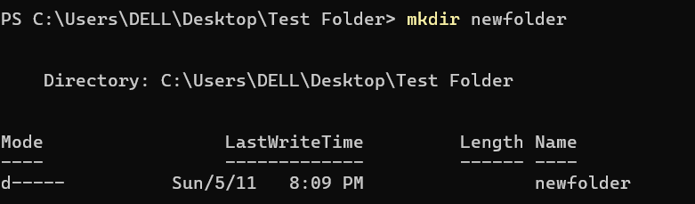

# dev-diary

## Introduction

Hi, I'm **Fahad Al Samarat**
I'm currently learning JavaScript and diving into the world of web development.
Passionate about building interactive websites and constantly exploring new tech.

## What i learned from the good developer mindset article

**The article**
[link](https://www.bomberbot.com/software-development/learn-the-fundamentals-of-a-good-developer-mindset-in-15-minutes/)

- Value Over Perfection: Focus on solving problems, not writing perfect code.

- Simplify Solutions: Opt for clear, easy-to-understand solutions.***

- Test First: Use test-driven development to ensure code reliability.***

- Keep Learning: Stay curious and continue improving your skills.

- ***Break Problems Down: Split complex tasks into smaller, manageable pieces.

## Some terminal command i use

cd,mkdir,ls,ls -force, rm,cp,mv

### Screenshots

